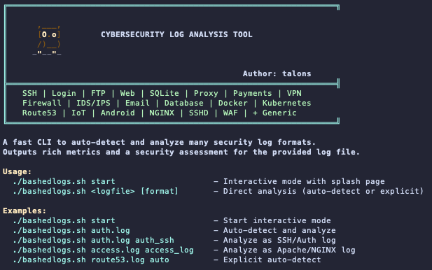
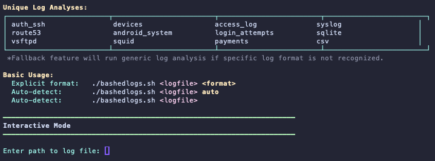

# bashedlogs

[](https://www.gnu.org/software/bash/)
[](https://github.com/ktalons/bashedlogs) [](https://github.com/ktalons/bashedlogs)
[](https://github.com/ktalons/bashedlogs/graphs/commit-activity)
[](https://opensource.org/licenses/MIT)

> 🦉 A fast, intelligent CLI tool for comprehensive cybersecurity log analysis with automatic format detection

---

## 📋 Quick Start

Clone the repository:
```bash
git clone https://github.com/ktalons/bashedlogs.git
cd bashedlogs
```

Make executable:
```bash
chmod +x bashedlogs.sh
```

Interactive mode:
```bash
./bashedlogs.sh start
```

Direct analysis (auto-detect format):
```bash
./bashedlogs.sh /path/to/logfile.log
```

Explicit format specification:
```bash
./bashedlogs.sh /path/to/auth.log auth_ssh
```

---

## 💡 Usage

### **Interactive Mode**
```bash
./bashedlogs.sh start
```
Launches an interactive session with format selection and guided analysis.

### **Direct Analysis**

Auto-detect log format:
```bash
./bashedlogs.sh access.log
```

Specify format explicitly:
```bash
./bashedlogs.sh auth.log auth_ssh
./bashedlogs.sh access.log access_log
./bashedlogs.sh route53.log route53
```

### **Supported Log Formats**
- **SSH/Auth Logs** (`auth_ssh`) - Authentication attempts, SSH sessions
- **Web Servers** (`access_log`) - Apache/NGINX access logs
- **DNS** (`route53`) - AWS Route53 DNS query logs
- **IoT Devices** (`devices`) - Smart device telemetry and status
- **Mobile/Android** (`android_system`) - Android system logs
- **Login Attempts** (`login_attempts`) - Failed/successful login tracking
- **SQLite** (`sqlite`) - SQLite database logs
- **FTP** (`vsftpd`) - VSFTPD server logs
- **Proxy** (`squid`) - Squid proxy access logs
- **Payments** (`payments`) - Payment transaction logs
- **Generic** - Fallback analyzer for unrecognized formats

**Plus support for:** Firewall (iptables, pfSense, Cisco ASA), IDS/IPS (Snort, Suricata), Email (Postfix, SMTP), VPN (OpenVPN), Databases (MySQL, PostgreSQL, MongoDB), Docker, Kubernetes, HAProxy, ModSecurity WAF, DHCP, CSV, and JSON formats.

---

## 🔍 Executive Summary

**bashedlogs** is a comprehensive bash-based log analysis framework designed for cybersecurity professionals, CTF competitors, and system administrators. The tool provides:

### **Core Capabilities**
- **Intelligent Format Detection** - Automatically identifies 30+ log formats using pattern matching and heuristics
- **Security Risk Assessment** - Calculates threat scores and provides actionable security recommendations
- **Rich Metrics & Statistics** - Extracts detailed insights including top IPs, error patterns, authentication events, and temporal analysis
- **Multi-Domain Support** - Analyzes logs from web servers, DNS, firewalls, databases, containers, IoT devices, mobile systems, and more
- **Zero Dependencies** - Pure bash implementation using standard Unix tools (awk, grep, sed)

### **Major Functions**

#### **1. Format Detection Engine**
Analyzes log structure and content patterns to automatically identify the log type. Supports explicit format override for edge cases.

#### **2. Specialized Analyzers**
Each log format has a dedicated analyzer with format-specific metrics:
- **DNS Analysis** - Query patterns, domain rankings, NXDOMAIN detection, DNS tunneling indicators
- **IoT Analysis** - Device health, battery monitoring, sensor anomalies, connectivity issues
- **Mobile Analysis** - Biometric auth, battery timeline, WiFi signal strength, app security events
- **Web Analysis** - HTTP status codes, top URLs, traffic volume, 404 analysis
- **Authentication Analysis** - Failed logins, brute force detection, privilege escalation attempts

#### **3. Security Threat Assessment**
Calculates risk scores based on:
- Attack pattern detection (SQL injection, XSS, path traversal)
- Authentication failures and brute force indicators
- Network anomalies and suspicious activities
- Error rates and system instability signals
- Format-specific threat models

#### **4. Visual Reporting**
Color-coded output with ASCII art, tables, and clear categorization for rapid assessment.

---

## 📸 Screenshots

### Splash Screen & Help


### Interactive Mode


---

## 📦 Requirements

- **Bash** 4.0 or higher
- Standard Unix utilities: `awk`, `grep`, `sed`, `sort`, `uniq`, `wc`, `head`, `tail`
- Optional: `bc` (for percentage calculations)
- Optional: `file` command (for SQLite detection)

---

## 🎯 Use Cases

- **Security Audits** - Analyze server logs for breach indicators
- **CTF Challenges** - Quickly parse and extract forensic evidence
- **Incident Response** - Identify attack patterns and timelines
- **System Monitoring** - Track authentication failures and errors
- **Compliance** - Generate security reports from log data
- **IoT Security** - Monitor device health and detect anomalies

---

## 🤝 Contributing

Contributions are welcome! Please feel free to submit a Pull Request.

---

## 📄 License

This project is licensed under the MIT License - see the [LICENSE](LICENSE) file for details.
